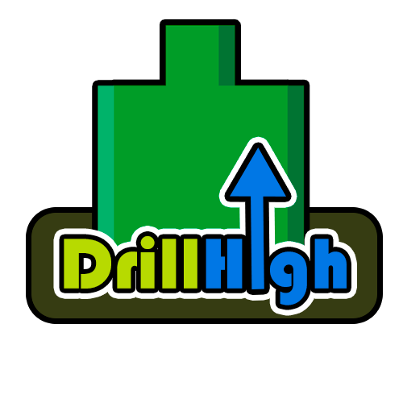
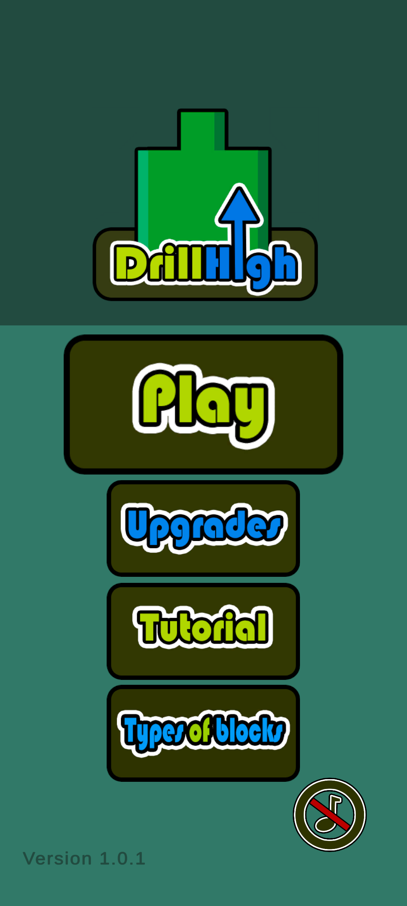
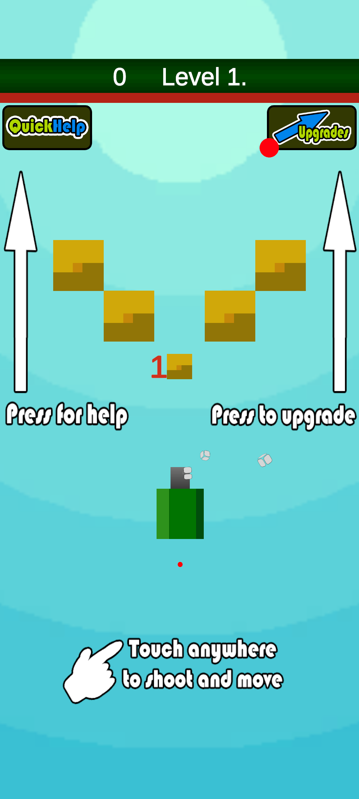
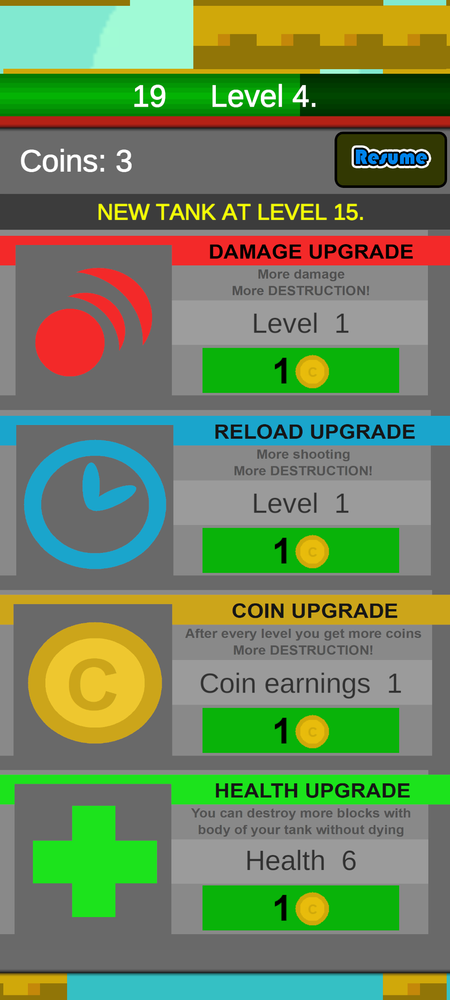
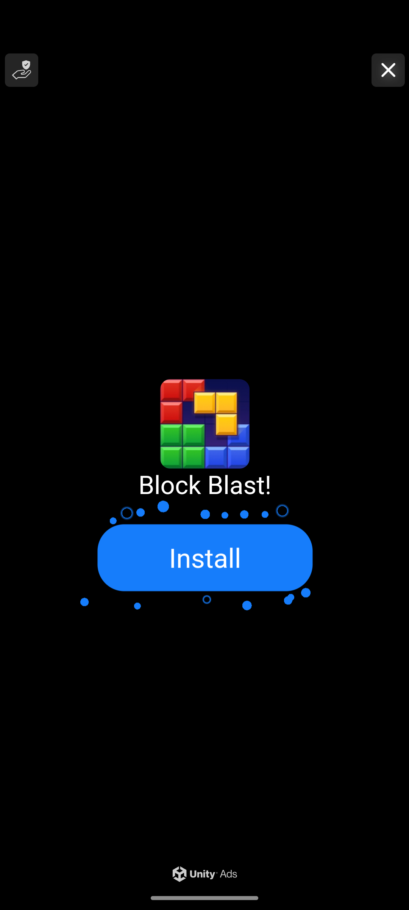
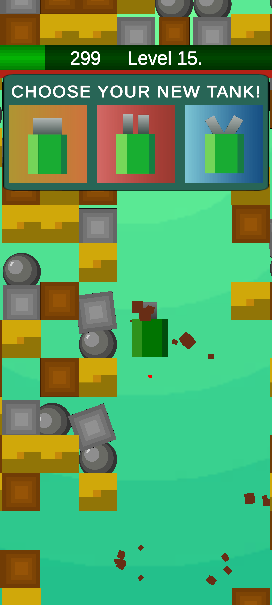

# Moja android hra vytvorená počas strednej školy
# DrillHigh 🎮

Bola vytvorená pomocou **Unity** a obsahuje reklamný systém **Unity Ads**, ktorý podporuje ďalší vývoj projektu. Hra je určená pre všetky vekové kategórie a ponúka unikátny herný zážitok!

---

## 📲 Stiahni si hru

Hru si môžeš stiahnuť priamo z Google Play kliknutím na tlačidlo nižšie:

❌Upozornenie HRA UŽ NIE JE PRISTUPNA na google play z dôvodu zmeny určitych pravidiel na platforme❌
---

## ✨ Hlavné funkcie

- 🎯 **Intuitívne ovládanie**: Hraj kdekoľvek a kedykoľvek.
- 🌟 **Ohromujúca grafika**: Vďaka výkonu Unity Engine.
- 🏆 **Rôzne herné módy**: Viac úrovní a výziev na zdolanie.
- 📺 **Unity Ads**: Podpor hru sledovaním reklám, ktoré umožňujú získavať odmeny.

---

## 🛠️ Použitá technológia

- **Unity Engine**: Vývoj a implementácia hry.
- **Unity Ads**: Monetizácia prostredníctvom reklám.
- **Google Play Console**: Distribúcia aplikácie.

---
## 😊 Screenshoty z hry

<table>
  <tr>
    <td>
      
      
Hlavné menu

    </td>
    <td>
      
      
Prehlad levelov

    </td>
    <td>
      
      
Hranie

    </td>
  </tr>
  <tr>
    <td>
      
      
Herné menu

    </td>
    <td>
      
      
FunkÄne spuštanie reklam

    </td>
     <td>
      
       
Vyber dalšich tankov

    </td>
  </tr>
</table>
